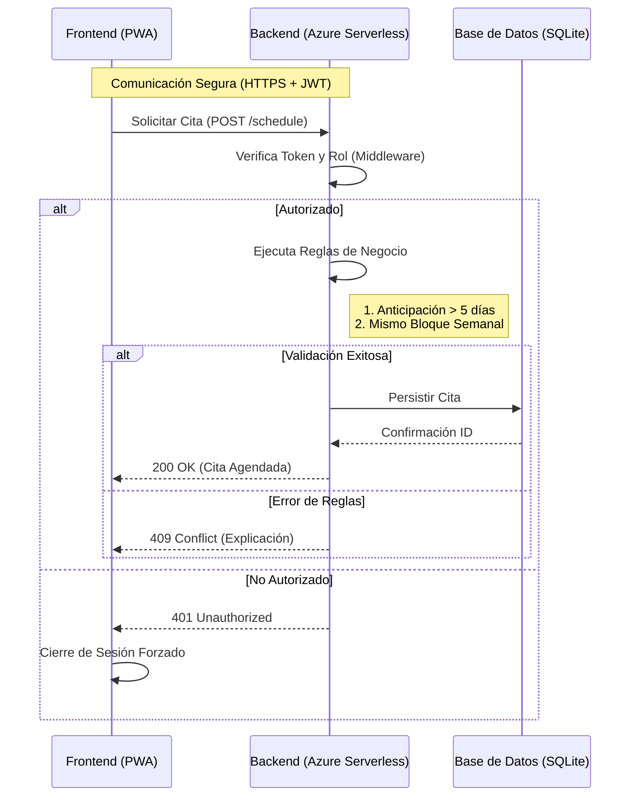
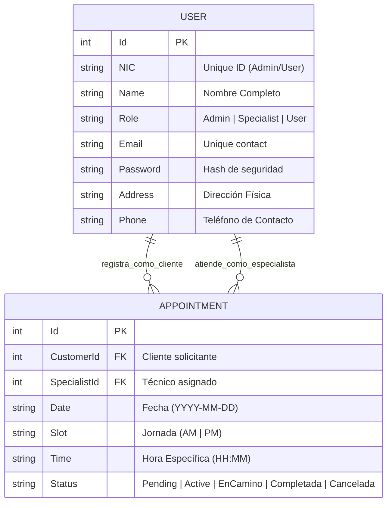
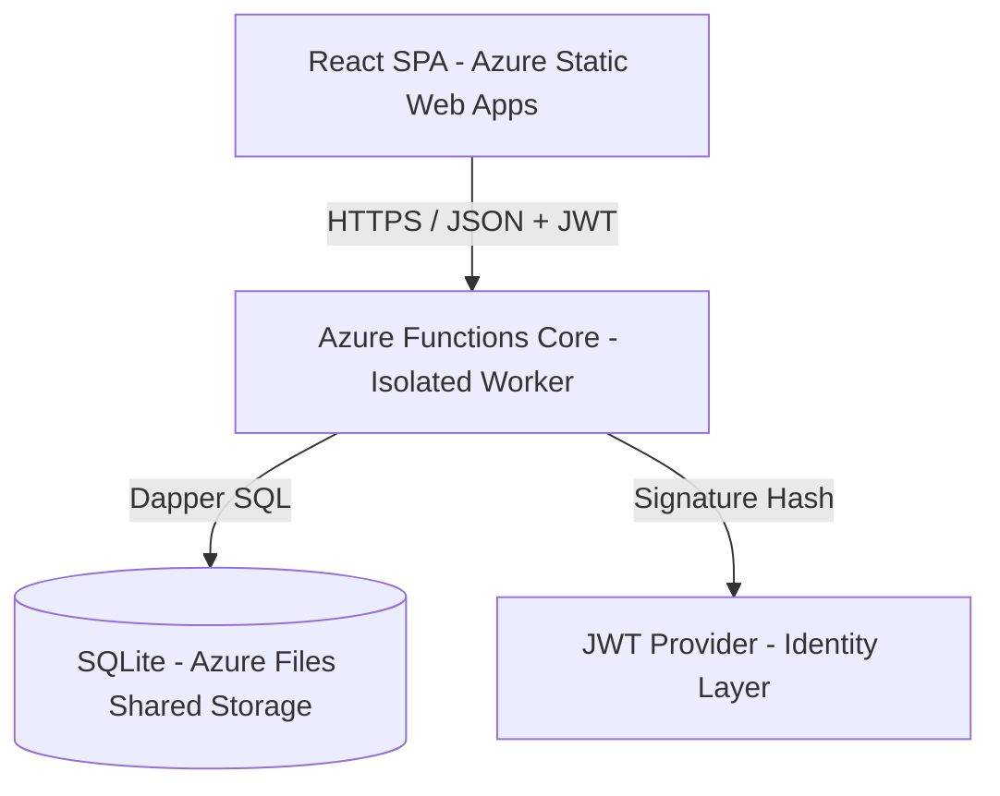

# FieldConnect: Enterprise Service Management Platform

[](https://dotnet.microsoft.com/)
[](https://reactjs.org/)
[](https://www.sqlite.org/)
[](https://tailwindcss.com/)

FieldConnect es una solución de grado empresarial para la orquestación de servicios técnicos y gestión de campo. Esta plataforma permite una interacción fluida entre **Clientes**, **Técnicos Especialistas** y **Administradores**, optimizando el ciclo de vida de las órdenes de servicio mediante una arquitectura serverless escalable y una interfaz premium.

---

## Especificaciones Técnicas

| Capa | Tecnologías | Propósito e Implementación |
| :--- | :--- | :--- |
| **Backend Core** | Azure Functions v4 (Isolated) | Ejecución distribuida e independiente del proceso del host para mayor seguridad y aislamiento. |
| **Acceso a Datos** | Dapper + Repository Pattern | Consultas SQL de alto rendimiento con inyección de dependencias para facilitar el testing unitario. |
| **Seguridad** | JWT + RBAC Pipeline | Middleware personalizado para validación de tokens y control de acceso basado en roles con normalización de rutas. |
| **Frontend** | React 18 + Vite | SPA optimizada con carga perezosa y renderizado basado en componentes atómicos. |
| **Control de Estado** | React Context API | Gestión centralizada de autenticación, notificaciones y persistencia de sesión en local storage. |
| **UI Framework** | Tailwind CSS v4 | Diseño moderno basado en utilidades, garantizando una estética premium y responsividad total. |

---

## Arquitectura del Sistema

### Flujo de Autenticación y Autorización
FieldConnect implementa un pipeline de middleware robusto que asegura cada transacción antes de que llegue a la lógica de negocio.



### Modelo de Dominio (Entidad-Relación)
La base de datos SQLite está estructurada para soportar múltiples roles y una trazabilidad completa de las citas.



### Arquitectura de Despliegue (Cloud-Native)

FieldConnect está diseñado para ejecutarse sobre la infraestructura global de **Azure**, aprovechando modelos de computación serverless para optimizar costos y escalabilidad.



---

## Product Backlog (User Stories)

1.  **Como Usuario final**, quiero poder **agendar citas técnicas** con al menos 5 días de anticipación, pudiendo agrupar múltiples visitas en la misma semana para mi conveniencia.
2.  **Como Administrador**, quiero **gestionar el catálogo de especialistas** (crear, ver carga laboral) para asegurar que el equipo técnico esté correctamente distribuido.
3.  **Como Especialista**, quiero **visualizar mis órdenes asignadas** y cambiar su estado (En Camino, Completada) para mantener informada a la central en tiempo real.
4.  **Como Usuario Autenticado**, quiero **editar mi perfil personal** para mantener mis datos de contacto actualizados para las visitas técnicas.

---

## Organización del Proyecto

### Backend (`/api`)
La arquitectura del backend sigue principios de **Clean Code** y **Repository Pattern**:

*   **`Functions/`**: Controladores serverless que gestionan los triggers HTTP.
*   **`Middleware/`**: Pipeline de ejecución para seguridad global (`JwtMiddleware`) y manejo de errores (`GlobalExceptionHandler`).
*   **`Repositories/`**: Capa de persistencia que ahora admite **Inyección de Dependencias** para facilitar el testing mockeado.
*   **`Models/`**: Definición de objetos de transferencia (DTOs) y entidades de dominio.
*   **`init.sql`**: Script de inicialización con esquema real y datos semilla para los tres roles.

### Frontend (`/web`)
El frontend está diseñado bajo una estructura modular y reactiva:

*   **`src/api/`**: Contiene el cliente de red centralizado y los **Contextos de React** (`Auth`, `Notifications`).
*   **`src/components/`**: Galería de componentes reutilizables (Botones, Inputs, Layouts).
*   **`src/pages/`**: Vistas de alto nivel protegidas por lógica de rutas por rol.
*   **`src/App.jsx`**: Configurador maestro de rutas con guardias de seguridad (`ProtectedRoute`).

---

---

## Prerrequisitos y Configuración Previa

Antes de iniciar la aplicación, asegúrate de tener instaladas las siguientes herramientas en tu sistema:

1.  **SDK de .NET 9.0**: Necesario para compilar y ejecutar el backend de C#. [Descargar aquí](https://dotnet.microsoft.com/download/dotnet/9.0).
2.  **Node.js (v18.0 o superior)**: Requerido para el entorno de ejecución del frontend y la gestión de paquetes npm. [Descargar aquí](https://nodejs.org/).
3.  **Azure Functions Core Tools (v4.x)**: Herramienta esencial para ejecutar el backend de manera local. Instálala con el comando: `npm install -g azure-functions-core-tools@4 --unsafe-perm true`.
4.  **IDE Recomendado**: Visual Studio Code con las extensiones "C# Dev Kit" y "Azure Functions".

---

## Guía Paso a Paso de Inicialización

Sigue estos pasos para configurar y ejecutar el ecosistema de **FieldConnect** en tu entorno local:

### 1. Clonación y Limpieza
```powershell
git clone <url-del-repositorio>
cd Challenge_Devops
```

### 2. Configuración del Backend (.NET 9)
El backend utiliza **Azure Functions** en modo de ejecución aislada.
1. **Prerrequisitos**: Asegúrate de tener instalado el SDK de .NET 9 y el [Azure Functions Core Tools](https://learn.microsoft.com/en-us/azure/azure-functions/functions-run-local).
2. **Variables de Entorno**: 
   - Dirígete a la carpeta `/api`.
   - Crea un archivo llamado `local.settings.json` (puedes basarte en `local.settings.json.example`).
   - Asegura que `JWT_SECRET` y `JWT_ISSUER` estén definidos.
3. **Ejecución**:
   ```powershell
   cd api
   func start
   ```
   *El sistema creará automáticamente el archivo `fieldconnect_secure.db` e inicializará el esquema si no existen.*

### 3. Configuración del Frontend (React + Vite)
1. **Instalación**:
   ```powershell
   cd web
   npm install
   ```
2. **Configuración**:
   - Crea un archivo `.env` basado en `.env.example`.
   - Define `VITE_API_URL` apuntando a tu instancia local de Functions (normalmente `http://localhost:7071/api`).
3. **Ejecución**:
   ```powershell
   npm run dev
   ```

### 4. Ejecución de Pruebas (Opcional)
Para validar la integridad de la lógica de negocio y los repositorios:
```powershell
cd .. # Regresa a la raíz
dotnet test tests/FieldConnect.Tests.csproj
```

---

## Credenciales de Prueba

Para facilitar la evaluación de la plataforma, el sistema incluye los siguientes usuarios semilla (seeds) con diferentes niveles de acceso:

| Rol | NIC (Usuario) | Password | Permisos |
| :--- | :--- | :--- | :--- |
| **Administrador** | `ADMIN01` | `admin123` | Dashboard total, gestión de especialistas, reasignación. |
| **Administrador** | `ADMIN02` | `admin123` | Acceso total administrativo. |
| **Especialista** | `SPEC01` | `spec123` | Visualización de órdenes, cambio de estados técnicos. |
| **Especialista** | `SPEC02` | `spec123` | Gestión de campo. |
| **Usuario / Cliente**| `123456` | `pass123` | Agendamiento, historial personal, perfil. |
| **Usuario / Cliente**| `789012` | `pass123` | Acceso estándar de cliente. |

---

## Pruebas y QA
La plataforma cuenta con una suite de pruebas automatizadas que validan la lógica crítica de negocio:
- **Pruebas de Repositorio**: Pruebas de integración con bases de datos temporales (SQLite).
- **Pruebas de Servicio**: Validación de la generación y firma de tokens JWT.
- **Comando de ejecución**: `dotnet test` desde la raíz del proyecto.

---

> [!TIP]
> **Segurización de Rutas**: La aplicación utiliza un sistema de "Normalización de Casing" en el middleware para evitar que discrepancias menores en las URLs comprometan la sesión del usuario.

---

## Elementos de Valor Agregado (Puntos Extra)

- **Tests Unitarios Técnicos**: Suite integrada en XUnit que valida lógica de repositorio, inyección de dependencias y seguridad JWT.
- **Validaciones UX en Tiempo Real**: Sistema de validación para agendamientos (bloqueo inteligente de fechas sin 5 días de anticipación y lógica de agrupación semanal).
- **Diseño de Grado Corporativo**: UI premium en Tailwind v4 con soporte completo para la colorimetría de Electra S.A.
- **Dockerización Nativa**: Archivo `Dockerfile` integrado para despliegue consistente en contenedores.
- **Arquitectura Inyectable**: Refactorización del patrón repositorio para permitir aislamiento total en pruebas unitarias.
- **Seguridad Robusta**: Implementación de **BCrypt** para el hashing de contraseñas y sanitización de inputs en el backend.

## Limitaciones Conocidas

- **Persistencia en SQLite**: Dado el modelo serverless (Azure Functions), se recomienda escalar a Azure SQL en ambientes de producción con alta concurrencia.

---

© 2026 **Electra S.A.** - Soluciones de Ingeniería para Gestión de Campo.
